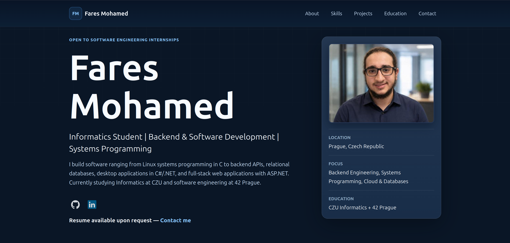

# Fares Mohamed Portfolio

A production-ready personal portfolio built with **ASP.NET Core 8**, **C#**, **HTML**, **CSS**, and **vanilla JavaScript**.

The project showcases my software engineering work, technical skills, academic background, and personal projects while demonstrating modern backend development, responsive frontend design, REST APIs, and maintainable application architecture.

🌐 **Live Demo:** https://your-domain.com *(Update after deployment)*

---

## Preview



---

# About

This portfolio was designed as more than a static website. It serves as a production-style web application that demonstrates software engineering practices including:

- ASP.NET Core MVC architecture
- REST API development
- JSON-driven content management
- Responsive and mobile-first UI
- Dynamic project pages
- SEO optimization
- Clean and maintainable code structure

All portfolio content is stored in JSON files, allowing projects, education, experience, and skills to be updated without modifying the frontend.

---

# Features

- Responsive design for desktop, tablet, and mobile
- ASP.NET Core 8 backend
- REST API endpoints
- JSON-driven content management
- Dynamic project detail pages
- Automatic image galleries
- SEO-friendly metadata
- Sitemap and robots.txt
- Clean component-based frontend
- Lightweight and dependency-free JavaScript

---

# Technologies

### Backend

- ASP.NET Core 8
- C#
- REST APIs
- JSON

### Frontend

- HTML5
- CSS3
- JavaScript (ES6)

### Development

- Git
- GitHub
- Linux
- Visual Studio Code

### Deployment

- Nginx
- systemd
- HTTPS (Certbot)

---

# Project Structure

```
Controllers/        ASP.NET API endpoints
Models/             Data transfer objects (DTOs)
Services/           JSON data services

wwwroot/
├── api/            Portfolio and project data
├── assets/         Images, screenshots, icons
├── css/            Stylesheets
├── files/          Downloadable files
└── js/             Frontend JavaScript
```

### Data

- `wwwroot/api/profile.json`
  - Personal information
  - Education
  - Experience
  - Skills
  - Learning roadmap

- `wwwroot/api/projects.json`
  - Project cards
  - Project detail pages
  - Technologies
  - Screenshot galleries

---

# Local Development

Restore dependencies:

```bash
DOTNET_CLI_HOME=/tmp/dotnet DOTNET_SKIP_FIRST_TIME_EXPERIENCE=1 dotnet restore --ignore-failed-sources
```

Run the application:

```bash
DOTNET_CLI_HOME=/tmp/dotnet DOTNET_SKIP_FIRST_TIME_EXPERIENCE=1 dotnet run
```

Open the URL displayed in the terminal (typically):

```
http://localhost:5088
```

---

# Managing Projects

Projects are completely data-driven.

To add or edit a project:

1. Update `wwwroot/api/projects.json`
2. Give every project a unique `slug`
3. Add screenshots under:

```
wwwroot/assets/my-project/
```

Then reference the folder:

```json
"screenshots": [
    "/assets/my-project/"
]
```

The application automatically discovers every image inside the folder through the `/api/assets/{folder}` endpoint, allowing screenshots to be added or removed without changing any code.

Projects without screenshots automatically display the built-in placeholder illustration.

---

# Deployment

Publish the application:

```bash
dotnet publish -c Release -o /var/www/fares-portfolio
```

Create the systemd service:

```ini
[Unit]
Description=Fares Mohamed Portfolio
After=network.target

[Service]
WorkingDirectory=/var/www/fares-portfolio
ExecStart=/usr/bin/dotnet /var/www/fares-portfolio/FaresPortfolio.dll
Restart=always
RestartSec=10
KillSignal=SIGINT
SyslogIdentifier=fares-portfolio
User=www-data

Environment=ASPNETCORE_ENVIRONMENT=Production
Environment=ASPNETCORE_URLS=http://127.0.0.1:5000

[Install]
WantedBy=multi-user.target
```

Enable the service:

```bash
sudo systemctl daemon-reload
sudo systemctl enable fares-portfolio
sudo systemctl start fares-portfolio
```

Configure Nginx:

```nginx
server {
    listen 80;
    server_name your-domain.com;

    location / {
        proxy_pass http://127.0.0.1:5000;
        proxy_http_version 1.1;

        proxy_set_header Upgrade $http_upgrade;
        proxy_set_header Connection keep-alive;
        proxy_set_header Host $host;

        proxy_cache_bypass $http_upgrade;

        proxy_set_header X-Forwarded-For $proxy_add_x_forwarded_for;
        proxy_set_header X-Forwarded-Proto $scheme;
    }
}
```

Enable HTTPS:

```bash
sudo certbot --nginx -d your-domain.com
```

Before deployment, replace every occurrence of:

```
https://example.com
```

with your production domain inside:

- `wwwroot/index.html`
- `wwwroot/robots.txt`
- `wwwroot/sitemap.xml`

---

# Future Improvements

- Docker deployment
- CI/CD with GitHub Actions
- Azure App Service deployment
- Custom domain
- Analytics integration

---

# Contact

Feel free to reach out through the portfolio website:

- Email
- LinkedIn
- GitHub

---

## License

This repository is intended to showcase my software engineering work and personal projects.
