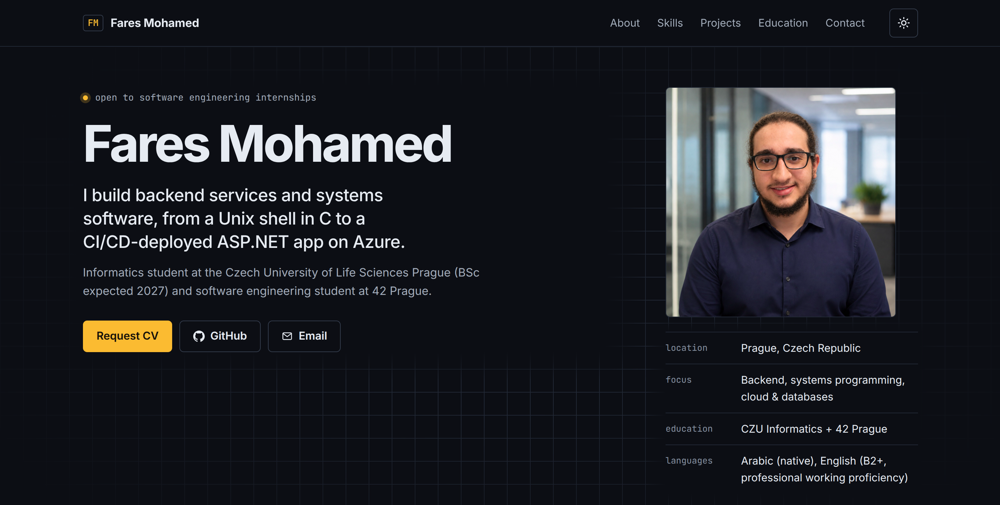

# Fares Mohamed Portfolio

Source for **[faresm.dev](https://faresm.dev)**: my personal portfolio, built with **ASP.NET Core 10**, **C#**, **Razor Pages**, and **vanilla JavaScript/CSS**, hosted on **Azure App Service** and deployed by **GitHub Actions**.



---

## How it works

- **Server-rendered pages.** The home page and one page per project are rendered with Razor Pages, so crawlers, link previews and visitors without JavaScript get complete HTML. JavaScript only adds progressive enhancements (mobile navigation, active-section highlighting, the screenshot gallery).
- **JSON-backed content.** All content lives in `Data/profile.json` and `Data/projects.json`, outside the web root, so the raw files are never served directly. A singleton data service reads them, caches the parsed result in memory and evicts it when a file changes.
- **REST API.** The same data service backs the JSON endpoints:
  - `GET /api/profile`
  - `GET /api/projects`
  - `GET /api/projects/{slug}`
  - `GET /api/assets/{folder}`: image files in a project's screenshot folder
- **Filesystem-driven galleries.** A project's screenshots are discovered from its folder under `wwwroot/assets/`, and image dimensions are read from the file headers so every `` ships with explicit `width`/`height`.
- **Real 404s.** Unknown routes and project slugs return a 404 status with a styled page.

## Deployment

Every push to `main` runs `.github/workflows/main_fares-portfolio.yml`:

1. **Build job:** `dotnet build`, `dotnet test` (the xUnit suite below), `dotnet publish`, then uploads the output as an artifact.
2. **Deploy job:** downloads the artifact, signs in to Azure with **OpenID Connect** (`azure/login` with `id-token: write`), and deploys to the `fares-portfolio` App Service with `azure/webapps-deploy`.

The workflow authenticates with a federated credential: GitHub issues a short-lived OIDC token that Azure exchanges for access. No publish profile or client secret is stored in the repository.

The site is served on the custom domain faresm.dev over HTTPS, with HSTS enabled outside development.

## Project structure

```
Controllers/        REST API endpoints
Data/               Portfolio and project content (JSON)
Models/             Content models
Pages/              Razor Pages (home, project detail, status pages) and shared partials
Services/           Data service, media discovery, image-size reader, skill usage
tests/              xUnit integration and unit tests
wwwroot/
├── assets/         Images, screenshots, icons
├── css/            Stylesheet
└── js/             Progressive-enhancement scripts
```

## Local development

Requires the .NET 10 SDK.

```bash
dotnet run
```

Then open <http://localhost:5088>.

Run the tests:

```bash
dotnet test tests/FaresPortfolio.Tests
```

The tests start the app in memory with `WebApplicationFactory`. They check that pages arrive server-rendered, that unknown pages return 404, that the API and data files behave as expected, and that no phone number is exposed.

## Managing content

Projects and profile content are data-driven; no code changes are needed to edit them.

1. Edit `Data/projects.json` (or `Data/profile.json`). Every project needs a unique `slug`; featured projects appear first, in file order.
2. Add screenshots under `wwwroot/assets/my-project/` and reference the folder:

```json
"screenshots": [
    "/assets/my-project/"
]
```

Every image in the folder is picked up automatically. Projects without screenshots fall back to their illustration.

Each skill in `Data/profile.json` shows which projects use it, matched by name against each project's `technologies` list.

## License

This repository is intended to showcase my software engineering work and personal projects.
